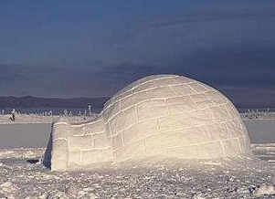
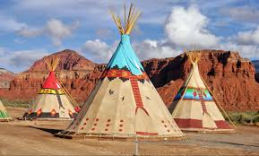
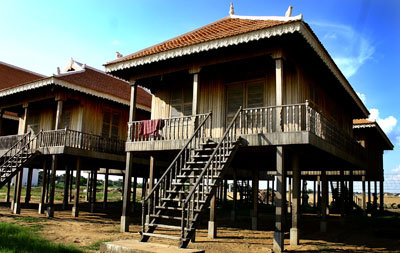
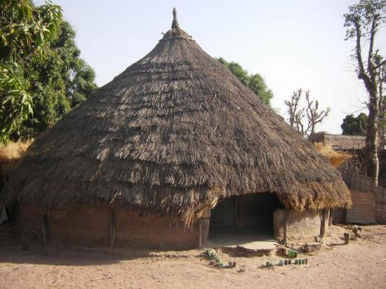
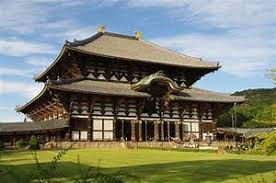
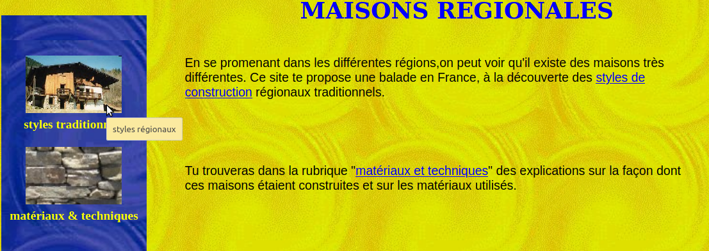
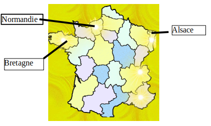
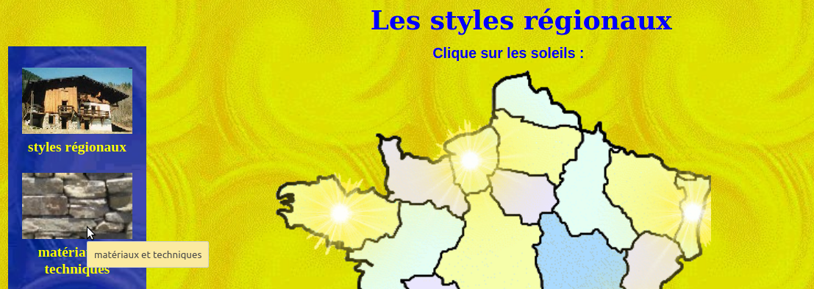

# Les matériaux d'une maison : diversité et  propriétés

#### L'objectif est d'identifier des matériaux utilisés dans des maisons géographiquement différentes, ainsi que leurs caractéristiques.{.objectif}
#### Compétences travaillées : identifier les matériaux et leur propriétés dans le cadre d'une production technique sur un objet.

# activité 1  : quels sont les matériaux utilisés dans les habitats suivants ? Pour quelle raison ?
 
**travail à faire **:  à l'aide des sites proposés ci-dessous, choisir une ou plusieurs maisons traditionnelles, cliquer sur les liens en bleu et sur une feuille de brouillon, relever  : **les matériaux utilisés** et **les raisons de leur utilisation**

 

* [igloo](https://www.bienchezsoi.net/articles/l-igloo-la-maison-inuite-du-pole-nord-1146.php)    {width=5cm}

* [tipi](http://amerindien.e-monsite.com/pages/les-habitations-amerindiennes.html)    {width=5cm}

* [maison sur piloti](http://www.habiter-autrement.org/11.construction/15_cons.htm)
[maison du monde](https://maison-monde.com/maisons-pilotis-kompong-phluk/)
 {width=5cm}

* [case africaine](http://aventure-pere-fils.e-monsite.com/pages/la-case-senegalaise.html) {width=5cm}

* [la maison japonaise]( http://www.japonismus.com/maison-japonaise-materiaux.html) {width=5cm}

# Activité préparatoire à l'activité 2 : recherche de définitions:
 

* roseau, fertile, silex

 

* crachin, granit, schiste, pisé

 

# Activité 2 : Quels sont les matériaux utilisés dans les différentes régions de France ? Quelles sont leurs propriétés ?
[document élève](5_4_materiau_maison_traditionnelle_influence_climatique_eleve.pdf)

Ouvrir le site [maisonsregionales.free.fr](http://maisonsregionales.free.fr/)

 

Sélectionner "les styles traditionnels"

 

{width=20cm}

**Travail à faire:** Cliquer sur les **soleil**»

Pour chaque maison traditionnelle des régions suivantes : **bretagne**, **normandie** et **alsace** , relever : 
 

* les matériaux offerts par la géographie locale (toit et murs).

 

* pour quelles contraintes climatiques utilise-ton ces matériaux
{width=15cm}

 

Rechercher le vocabulaire non connu

 

bilan :

Les bâtiments utilisent des matériaux  :
 
 	 en fonction de leur disponibilité géographique 
 	  
	 pour supporter les intempéries, conditions climatiques (froid, humidité, chaud, eau, neige, vent)
	  
    pour leurs propriétés (léger, isolant, démontable, solide)

 

# Pour aller plus loin : Cliquer sur « matériaux et techniques » et expliquer pour quelles contraintes climatiques on utilise  ces matériaux dans nos régions :
 
{width=15cm}
 

* ardoise : 
 
* bois : 
 
* terre :  